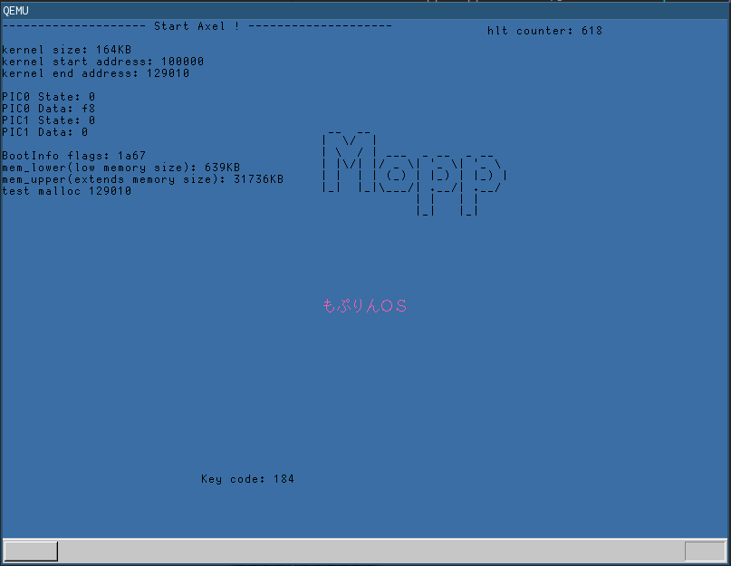
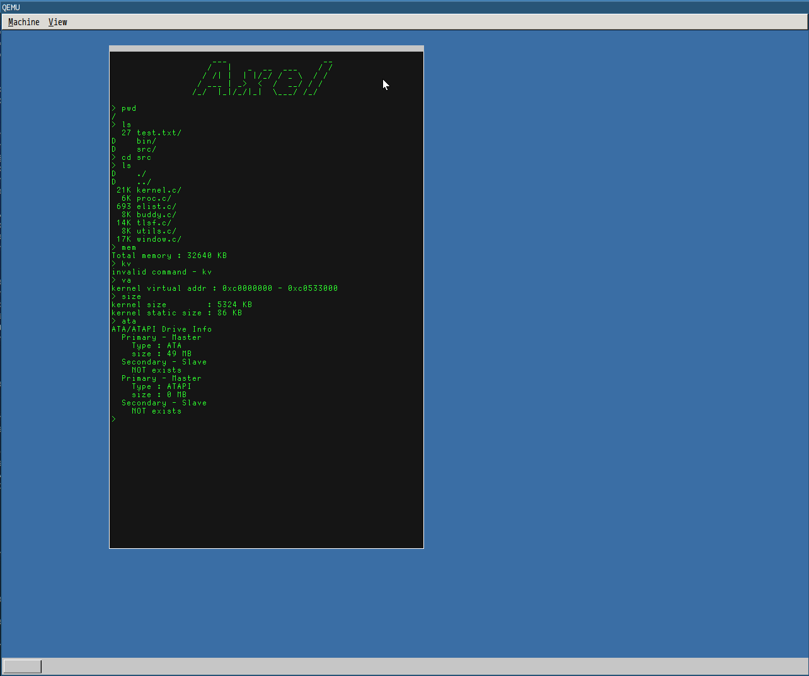

## Axel
Axel Accelerates All For Me !  
This is monolithic kernel written by C and nasm.  
And support architecture is only x86.

## Functions
- [x] Physical memory manager
- [x] x86 paging
- [x] Virtual memory manager
- [x] Interrupt
- [x] Mouse, Keyboard
- [x] Graphic(VBE)
- [x] ATA device control
- [ ] (WIP) User process
- [ ] (WIP) System call
- [ ] (WIP) Virtual filesystem
- [ ] Support ARM

## Requirements
nasm, qemu(VBE), grub


## How to use ISO file
```shell:variable
qemu-system-i386 -vga std -m 32 -cdrom axel.iso
```

## Setup Environment (NEW)
Please install requirements by using package manager or building from source.
If your clang is NOT enable cross-compiling, Please enable it.  
And If your host architecture is 64bit environment, You should install 32bit libc and etc.  
Because, Axel is 32bit yet :(

## ScreenShot



## :)

